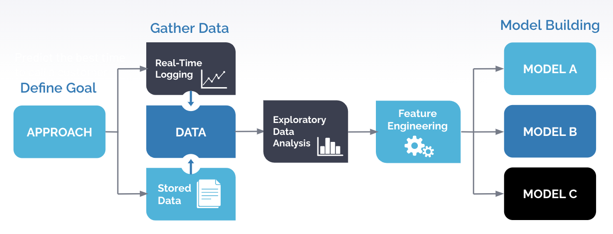

# Scheduling Calls with Predictive Modeling
:notes: Your phone rings.:notes: You see a number starting with 1-(800). What are the odds of you answering this call? 

The conversion rate of cold calls is around 3%. This means that for every 100 cold calls a sales representative makes, 97 of these calls will be unanswered. Moreover, if a company has 20 sales representatives who each call 100 potential customers each day for a total of 2000 calls, only 60 of these calls will be answered. By Moore's Law, technology is advancing at an exponential rate while telemarketers are still using techniques from the 1900's to reach potential customers. It is time to evolve from this outdated methods of reaching customers and use the tools of the 21st century to make telemarketers' life easier and more engaging, as well as cater calls to those who might actually be interested, with predictive modeling. 

# Table of contents

<!-- After you have introduced your project, it is a good idea to add a **Table of contents** or **TOC** as **cool** people say it. This would make it easier for people to navigate through your README and find exactly what they are looking for.

Here is a sample TOC(*wow! such cool!*) that is actually the TOC for this README. -->

- [Scheduling Calls with Predictive Modeling](#scheduling-calls-with-predictive-modeling)
- [Demo-Preview](#demo-preview)
- [Problem Statement](#problem-statement)
- [Formulating Questions](#formulating-questions)
- [Datasets](#datasets)
- [Solution](#solution)
- [Machine Learning System Design](#machine-learning-system-design)
- [Navigating the Repo](#navigating-the-repo)

# Demo-Preview

1. **Select file with contacts to call:** Select the CSV file which contains the list of contacts to call. The output is a dataframe sorted by the contact to prioritize, from highest priority to lowest priority. Each row in the dataframe contains the contact's ID, which day of week to call the contact, and the probability of a successful call. 

2. **Day or Week to Schedule:** Input the day of week to schedule call (ex: Wednesday) or "week" to schedule calls for the entire week. 

3. **Contact to Call:** Input the a contact's ID to get more information about the contact. The output is a row that contains information about the contact's job level, industry, company, and a list of topics of interest (talking points). 

[(Back to top)](#table-of-contents)

# Problem Statement
Sales representatives have one goal: to peak a prospective lead's interest enough such that a sale or opportunity is generated. Time is money and cold calling might as well be throwing money in a firepit for the company and the sales representative who may rely on commission from selling products. 

The first problem is that sales representatives are often blindly given a list of contacts to call. They have information about the contacts but there isn't a efficient system in place such that they know which contacts to prioritize. They can manually keep track of this using an Excel sheet or a notepad as they make more calls from the lest, but this is the extent of which calls are currently being prioritized. 

The second problem is that even using an Excel sheet can become extremely convoluted when one has to keep track of an ever-expanding list of contacts. For example, a sales representative might manually go through a list of 1000 contacts to find the couple of contacts to follow-up with based on their interest one month ago. This is a lot of extra manual labor making this process of calling customers even more inefficient than it already is. 

[(Back to top)](#table-of-contents)

# Formulating Questions
The problem with colding calling revolves around one core idea: EFFICIENCY. Cold calling has been proven to be extremely inefficient time and time again so the question then becomes: **How do we we make calls more efficient?**

We can then break this down into two further questions: 
1) How can we determine the best time to call a prospective lead?
2) What should we say to the prospective lead to keep them interested?

[(Back to top)](#table-of-contents)

# Datasets
<ul>
<li>calls.csv: a timeline of outgoing sales calls and the disposition of those calls</li>
<li>events.csv: any activities that we have on record taking place before the phone calls were made</li>
<li>companies.csv: the industry and employee count of the companies</li>
<li>people.csv: the people who were called, along with their job level and function and the ID of the company they work for</li>
<li>opportunities.csv: the date an opportunity was generated for a contact</li>
</ul>

[(Back to top)](#table-of-contents)

# Solution 
#### A predictive platform that helps schedule the best time to call a prospective lead and suggests talking points

The solution constist of two goals: 
1. Use predictive modeling to predict the best time to call a customer based on the customer's activity data.
2. Use NLP to generate a list of potential talking points for a sales representative based on the customer's recent engagements with the company.

Knowing when to call and what to say will significantly increase efficiency and churn rate, which will ultimately lead to more sales and opportunities for the business. 

[(Back to top)](#table-of-contents)

# Machine Learning System Design

[(Back to top)](#table-of-contents)

# Navigating the Repo
### EDA
This folder contains all the exploratory data analysis files and images. EDA was performed using Tableau and Matplotlib on the datasets from 6Sense. 
### demos
This folder contains all the visual demos for this project. 
### models 
This folder contains all the old versions of the model.  
### pipeline
This folder contains the most recent version of the model. The pipeline consist of three main steps separated into three iPython notebooks.

1) Data Preprocessing - DataPreprocessing.ipynb
- Cleans, preprocesses, transforms, and feature engineering is done in this notebook
- The output is a CSV file with the transformed data called tranformed_data.csv 

2) Model Building - ModelBuilding.ipynb
- Different models were trained in this notebook: Random Forest, Logistic Regression, KNN, XGBoost, LightGBM, etc. 
- Used k-fold cross validation to reduce overfitting
- Plotted an ROC curve and confusion matrices to evaluate the performance of the model
- Used GridSearchCV for hyperparameter optimization

3) System - System.ipynb
- Generates the outputs as a dataframe
- The dataframe is sorted based on the probability of a successful call and job level. 
- Job Levels were prioritized as follows: C-Level -> Vice President -> Director -> Manager -> Senior -> Staff -> Other
- Outputs additional information about specific contacts, for example, their job level, the industry they're in, company, topics of interest

[(Back to top)](#table-of-contents)

